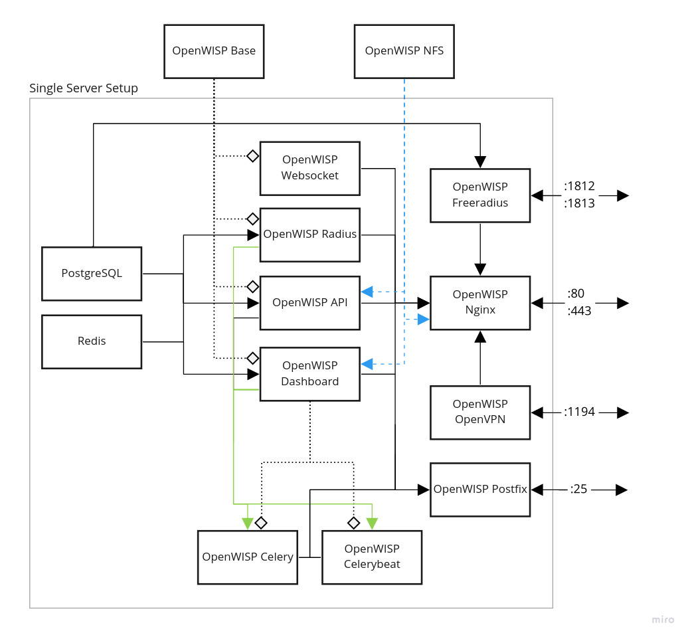

# Docker-OpenWISP

[](https://github.com/openwisp/docker-openwisp/actions?query=workflow%3A%22Automation+Tests%22)
[](https://gitlab.com/openwisp/docker-openwisp/container_registry)
[](https://gitter.im/openwisp/dockerize-openwisp?utm_source=badge&utm_medium=badge&utm_campaign=pr-badge)
[](http://openwisp.org/support.html)
[](https://github.com/openwisp/docker-openwisp/blob/master/LICENSE)

This repository contains official docker images of OpenWISP. Designed with horizontal scaling, easily replicable deployments and user customization in mind.


The sample files for deployment on kubernetes are available in the `deploy/examples/kubernetes/` directory.

## Table of contents

- [Docker-OpenWISP](#docker-openwisp)
  - [Table of contents](#table-of-contents)
  - [Images Available](#images-available)
    - [Image Tags](#image-tags)
  - [Architecture](#architecture)
  - [Deployment](#deployment)
    - [Quick Setup](#quick-setup)
    - [Compose](#compose)
    - [Kubernetes](#kubernetes)
  - [Customization](#customization)
    - [Custom Django Settings](#custom-django-settings)
    - [Custom Styles and JavaScript](#custom-styles-and-javascript)
    - [Customizing uWSGI configuration](#customizing-uwsgi-configuration)
    - [Changing Python Packages](#changing-python-packages)
    - [Disabling Services](#disabling-services)
  - [Development](#development)
    - [Workbench setup](#workbench-setup)
    - [Runtests](#runtests)
    - [Run Quality Assurance Checks](#run-quality-assurance-checks)
  - [Usage](#usage)
    - [Makefile Options](#makefile-options)

## Images Available

| Version | Corresponding Ansible Version |
| ------- | :---------------------------: |
| 0.1.0a2 |             0.9.0             |
| 0.1.0a3 |            0.12.0             |
| 0.1.0a4 |            0.12.0+            |
| 0.1.0a5 |            0.13.1             |
| 0.1.0a6 |            0.13.2+            |

\* Roughly the same features would be available but it's not an exact one-to-one mapping.

The images are hosted on [Docker Hub](https://hub.docker.com/u/openwisp)
and [GitLab Container Registry](https://gitlab.com/openwisp/docker-openwisp/container_registry).

### Image Tags

All images are tagged using the following convention:

|  Tag   | Software Version                              |
| ------ |---------------------------------------------- |
| latest | Images built on the **latest git tag**        |
| edge   | Images built on the **current master branch** |

## Architecture

A typical OpenWISP installation is made of multiple components
(e.g. application servers, background workers, web servers,
database, messaging queue, VPN server, etc. ) that have different
scaling requirements.

The aim of Docker OpenWISP is to allow deploying
OpenWISP in cloud based environments which
allow potentially infinite horizontal scaling.
That is the reason for which there are different
docker images shipped in this repository.



- **openwisp-dashboard**: Your OpenWISP device administration dashboard.
- **openwisp-api**: HTTP API from various openwisp modules which can be scaled simply by having multiple
  API containers as per requirement.
- **openwisp-websocket**: Dedicated container for handling websocket requests, eg. for updating location of
  mobile network devices.
- **openwisp-celery**: Runs all the background tasks for OpenWISP, eg. updating configurations of your device.
- **openwisp-celery-monitoring**: Runs background tasks that perform active monitoring checks,
  eg. ping checks and configuration checks. It also executes task for writing monitoring data
  to the timeseries DB.
- **openwisp-celerybeat**: Runs periodic background tasks. eg. revoking all the expired certificates.
- **openwisp-nginx**: Internet facing container that facilitates all the HTTP and Websocket communication
  between the outside world and the service containers.
- **openwisp-freeradius**: Freeradius container for OpenWISP.
- **openwisp-openvpn**: OpenVPN container for out-of-the-box management VPN.
- **openwisp-postfix**: Mail server for sending mails to MTA.
- **openwisp-nfs**: NFS server that allows shared storage between different machines. It does not run
  in single server machines but provided for K8s setup.
- **openwisp-base**: It is the base image which does not run on your server, but openwisp-api & openwisp-dashboard use it as a base.
- **Redis**: data caching service (required for actions like login).
- **PostgreSQL**: SQL database container for OpenWISP.

## Deployment

### Quick Setup

The `auto-install.sh` script can be used to quickly install a simple instance of openwisp on your server.

[](https://www.youtube.com/watch?v=LLbsKP79MzE "Install tutorial")

If you have created a [`.env` file](docs/ENV.md) to configure your instance, then you can use it with the script otherwise.

**It asks 5 questions for application configuration, 3 of them are domain names.** The dashboard, api & openvpn can be setup on different domain, **please ensure the domains you enter point to your server**. The remaining **2 questions are email id** for site manager email (used by django to send application emails) and letsencrypt (used by [certbot](https://certbot.eff.org/) to issue https certs on this address.)

To get started, run the following command:

```bash
   curl https://raw.githubusercontent.com/openwisp/docker-openwisp/master/deploy/auto-install.sh -o setup.sh
   sudo bash setup.sh
   # If you are upgrading from an older version setup by this script use
   # sudo bash setup.sh --upgrade
   # For more information
   # sudo bash setup.sh --help
```

To get a real-time streaming output of autoinstall logs, run the following command:

```bash
tail -n 50 -f /opt/openwisp/autoinstall.log
```

**Notes:**

- If you're having any installation issues with the `latest` version, you can try auto-installation
  with the `edge` version, which has images built on the current master branch.

- Still facing errors while installation? Please [read the FAQ](docs/FAQ.md).

### Compose

[Setup on docker compose](docs/QUICK_SETUP.md) is suitable for single-server setup requirements. It is quicker and requires less prior knowledge about openwisp & networking.

### Kubernetes

Setup on kubernetes is complex and requires prior knowledge about linux systems, kubernetes, docker & openwisp. However, it provides scalability for very large networks.

- [Bare Metal](docs/kubernetes/BARE_METAL.md)
- [Google Cloud](docs/kubernetes/GOOGLE_CLOUD.md)

Useful commands for startup and readiness probes which are provided
by the images:

- startup probe example: `test $(ps aux | grep -c uwsgi) -ge 2`
- readiness probe example: `python services.py uwsgi_status "127.0.0.1:8001"`

## Customization

The following commands will create the directory structure required for
adding customizations. Execute these commands in the same location
as the `docker-compose.yml` file.

```shell
mkdir -p customization/configuration/django
touch customization/configuration/django/__init__.py
touch customization/configuration/django/custom_django_settings.py
mkdir -p customization/theme
```

You can also refer to the [directory structure of this repository](https://github.com/openwisp/docker-openwisp/tree/master/customize)
for an example.

### Custom Django Settings

The `customization/configuration/django` directory created in the above section
is mounted at `/opt/openwisp/openwisp/configuration` in the `dashboard`, `api`,
`celery`, `celery_monitoring` and `celerybeat` containers.

You can specify additional Django settings (e.g. SMTP configuration) in the
`customization/configuration/django/custom_django_settings.py` file.
Django will use these settings at the project startup.

You can also put additional files in `customization/configuration/django` that
needs to be mounted at `/opt/openwisp/openwisp/configuration` in the containers.

### Custom Styles and JavaScript

If you want to use your custom styles, add custom JavaScript you can follow the following guide.

1. Read about the option [`OPENWISP_ADMIN_THEME_LINKS`](https://github.com/openwisp/openwisp-utils/#openwisp_admin_theme_links). Please make [ensure the value you have enter is a valid JSON](https://jsonlint.com/) and add the desired JSON in `.env` file. example:

```bash
OPENWISP_ADMIN_THEME_LINKS=[{"type": "text/css", "href": "/static/custom/css/custom-theme.css", "rel": "stylesheet", "media": "all"},{"type": "image/x-icon", "href": "/static/custom/bootload.png", "rel": "icon"},{"type": "image/svg+xml", "href": "/static/ui/openwisp/images/openwisp-logo-small.svg", "rel": "icons"}]
```

2. Create your custom CSS / Javascript file in `customization/theme` directory created
   in the above section. E.g. `customization/theme/static/custom/css/custom-theme.css`.
3. Start the nginx containers.

**Notes:**

1. You can edit the styles / JavaScript files now without restarting the container, as long as file is in the correct place, it will be picked.
2. You can create a `maintenance.html` file inside the `customize` directory to have a custom maintenance page for scheduled downtime.

### Customizing uWSGI configuration

By default, you can only configure [`processes`, `threads` and `listen`
settings of uWSGI using environment variables](docs/ENV.md#uWSGI).
If you want to configure more uWSGI settings, you can supply your uWSGI
configuration by following these steps:

1. Create the uWSGI configuration file in the `customization/configuration` directory.
   For the sake of this example, let's assume the filename is `custom_uwsgi.ini`.
2. In `dashboard` and `api` services of `docker-compose.yml`, add volumes as following

```yml
  services:
    dashboard:
      ... # other configuration
      volumes:
        ... # other volumes
        - ${PWD}/customization/configuration/custom_uwsgi.ini:/opt/openwisp/uwsgi.ini:ro
    api:
      ... # other configuration
      volumes:
        ... # other volumes
        - ${PWD}/customization/configuration/custom_uwsgi.ini:/opt/openwisp/uwsgi.ini:ro
```

### Changing Python Packages

You can build with your own python package by creating a file named `.build.env` in the root of the repository, then set the variables inside `.build.env` file in `<variable>=<value>` format. Multiple variable should be separated in newline. These are the variables that can be changed:

- `OPENWISP_MONITORING_SOURCE`
- `OPENWISP_FIRMWARE_SOURCE`
- `OPENWISP_CONTROLLER_SOURCE`
- `OPENWISP_NOTIFICATION_SOURCE`
- `OPENWISP_TOPOLOGY_SOURCE`
- `OPENWISP_RADIUS_SOURCE`
- `OPENWISP_IPAM_SOURCE`
- `OPENWISP_USERS_SOURCE`
- `OPENWISP_UTILS_SOURCE`
- `DJANGO_X509_SOURCE`
- `DJANGO_SOURCE`

For example, if you want to supply your own django and openwisp-controller source, your `.build.env` should be written like this:

```
DJANGO_SOURCE=django==3.2
OPENWISP_CONTROLLER_SOURCE=https://github.com/<username>/openwisp-controller/tarball/master
```

### Disabling Services

**Right now, this is only tentative guide. Errata may exist. Please report errors on the [gitter channel](https://gitter.im/openwisp/dockerize-openwisp).**

- `openwisp-dashboard`: You cannot disable the openwisp-dashboard. It is the heart of OpenWISP and performs core functionalities.
- `openwisp-api`: You cannot disable the openwisp-api. It is required for interacting with your devices.
- `openwisp-websocket`: Removing this container will cause the system to not able to update real-time location for mobile devices.

If you want to disable a service, you can simply remove the container for that service, however, there are additional steps for some images:

- `openwisp-network-topology`: Set the `USE_OPENWISP_TOPOLOGY` variable to `False`.
- `openwisp-firmware-upgrader` : Set the `USE_OPENWISP_FIRMWARE` variable to `False`.
- `openwisp-monitoring` : Set the `USE_OPENWISP_MONITORING` variable to `False`.
- `openwisp-radius` : Set the `USE_OPENWISP_RADIUS` variable to `False`.
- `openwisp-postgres`: If you are using a seperate database instance,
  - Ensure your database instance is reachable by the following OpenWISP containers: `openvpn`, `freeradius`, `celerybeat`, `celery`, `celery_monitoring`, `websocket`, `api`, `dashboard`.
  - Ensure your database server supports GeoDjango. (Install PostGIS for PostgreSQL)
  - Change the [database configuration variables](docs/ENV.md) to point to your instances, if you are using SSL, remember to set `DB_SSLMODE`, `DB_SSLKEY`, `DB_SSLCERT`, `DB_SSLROOTCERT`.
  - If you are using SSL, remember to mount volume containing the certificates and key in all the containers which contact the database server and make sure that the private key permission is `600` and owned by `root:root`.
  - In your database, create database with name `<DB_NAME>`.
- `openwisp-postfix`:
  - Ensure your SMTP instance reachable by the OpenWISP containers.
  - Change the [email configuration variables](docs/ENV.md) to point to your instances.

## Development

### Workbench setup

1. Install Docker & Docker Compose v2.
2. In the root of the repository, run `make develop`, when the containers are ready, you can test them out by going to the domain name of the modules.

**Notes:**

- Default username & password are `admin`.
- Default domains are: `dashboard.openwisp.org` and `api.openwisp.org`.
- To reach the dashboard you may need to add the openwisp domains set in your `.env` to your `hosts` file,
  example: `bash -c 'echo "127.0.0.1 dashboard.openwisp.org api.openwisp.org" >> /etc/hosts'`
- Now you'll need to do steps (2) everytime you make a changes and want to build the images again.
- If you want to perform actions like cleaning everything produced by `docker-openwisp`,
  please use the [makefile options](#makefile-options).

### Runtests

You can run tests either with `geckodriver` (firefox) or `chromedriver` (chromium). Chromium is preferred as it checks for console log errors as well.

1. Setup driver for selenium:

   - Setup chromedriver

     1. Install chromium:

     ```bash
     # On debian
     sudo apt --yes install chromium
     # On ubuntu
     sudo apt --yes install chromium-browser
     ```

     3. Check version: `chromium --version`
     4. Install Driver for your version: [`https://chromedriver.chromium.org/downloads`](https://chromedriver.chromium.org/downloads)
     5. Extract chromedriver to one of directories from your `$PATH`. (example: `/usr/bin/`)

   - Setup geckodriver

     1. Install: `sudo apt --yes install firefox`
     2. Check version: `firefox --version`
     3. Install Driver for your version: [`https://github.com/mozilla/geckodriver/releases`](https://github.com/mozilla/geckodriver/releases)
     4. Extract geckodriver to one of directories from your `$PATH`. (example: `/usr/bin/`)

2. Install selenium: `python3 -m pip install selenium`

3. (Optional) Configure: open `tests/config.json` and configure variables as per your requirement, options are:

   ```yaml
   driver: Name of driver to use for tests, "chromium" or "firefox"
   logs: print container's logs if an error occurs.
   logs_file: Location of the log file for saving logs generated for tests.
   headless: Run selenium chrome driver in headless mode
   load_init_data: Flag for running tests/data.py, only needs to be done once after database creation
   app_url: URL to reach the admin dashboard
   username: username for logging in admin dashboard
   password: password for logging in admin dashboard
   services_max_retries: Maximum number of retries to check if services are running
   services_delay_retries: Delay time (in seconds) to each retries for checking if services are running
   ```

4. Run tests: `make runtests`

**Note:** To run a single test use the following command

```bash
python3 tests/runtests.py <TestSuite>.<TestCase>
# python3 tests/runtests.py TestServices.test_celery
```

### Run Quality Assurance Checks

We use [shfmt](https://github.com/mvdan/sh#shfmt) to format shell scripts and
[hadolint](https://github.com/hadolint/hadolint#install) to lint Dockerfile

To format all files, Run:

```
./qa-format
```

To run quality assurance checks you can use the `run-qa-checks` script:

```
# install test requirements first
pip install requirements-test.txt

# run QA checks before committing code
./run-qa-checks
```

## Usage

### Makefile Options

Most commonly used:

- `start`<USER=docker-username> <TAG=image-tag>: Start OpenWISP containers on your server.
- `pull`<USER=docker-username> <TAG=image-tag>: Pull Images from registry.
- `stop`: Stop make containers on your server.
- `develop`: Bundles all the commands required to build the images and run containers.
- `runtests`: Run testcases to ensure all the services are working.
- `clean`: Aggressively purge all the containers, images, volumes & networks related to `docker-openwisp`.

Other options:

- `publish` <USER=docker-username> <TAG=image-tag>: Build, test and publish images.
- `python-build`: Generate a random django secret and set it in the `.env` file.
- `nfs-build`: Build openwisp-nfs server image.
- `base-build`: Build openwisp-base image. The base image is used in other OpenWISP images.
- `compose-build`: (default) Build OpenWISP images for development.
- `develop-runtests`: Similar to `runtests`, it runs the testcases except doesn't stop the containers after running the tests which maybe desired for debugging & analyzing failing container's logs.
