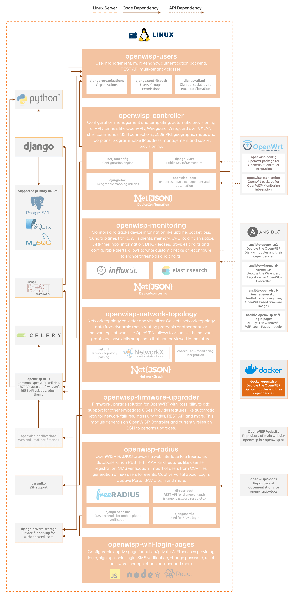

#################
 Docker OpenWISP
#################

.. seealso::

    **Source code**: `github.com/openwisp/docker-openwisp
    <https://github.com/openwisp/docker-openwisp>`_.

Docker-OpenWISP makes it possible to set up isolated and reproducible
OpenWISP environments, simplifying the deployment and scaling process.

The following diagram illustrates the role of Docker OpenWISP within the
OpenWISP architecture.

    **OpenWISP Architecture: highlighted Docker OpenWISP**

.. important::

    For an enhanced viewing experience, open the image above in a new
    browser tab.

    Refer to :doc:`/general/architecture` for more information.

.. toctree::
    :caption: Docker OpenWISP Usage Docs
    :maxdepth: 1

    ./user/quickstart.rst
    ./user/architecture.rst
    ./user/settings.rst
    ./user/customization.rst
    ./user/faq.rst

.. toctree::
    :caption: Docker OpenWISP Developer Docs
    :maxdepth: 2

    ./developer/instructions.rst
