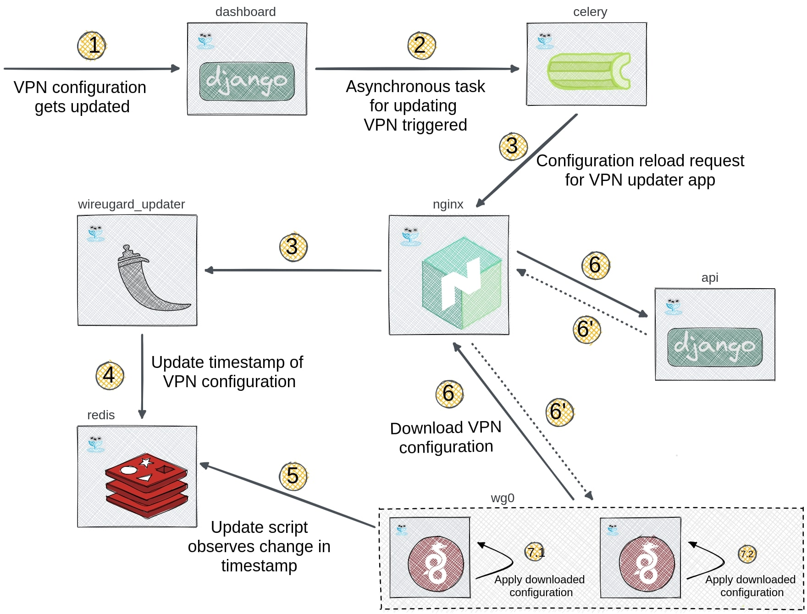

# Deploying WireGuard VPN

The WireGuard support in docker-openwisp comprises of two containers:

1. The `wireguard` container which acts as the WireGuard VPN server
2. The `wireguard-updater` container which is responsible for
   triggering configuration updates on the `wireguard` container.

This de-coupling allows management of multiple `wireguard` containers
with only one `wireguard-updater` container.

With this context, you can now proceed to add WireGuard support on
your installation.

WireGuard support is implemented as an add-on to docker-openwisp.
Contrary to OpenVPN's support, you need a running docker-openwisp instance
before proceeding with this guide. Follow the instructions in the
["Deployment" section of the project's README](../../README.md#deployment)
if you haven't started with docker-openwisp.

Once you can access the OpenWISP dashboard, create a WireGuard VPN server
on OpenWISP dashboard as mentioned in [OpenWISP's documentation](https://openwisp.io/docs/user/wireguard.html#how-to-setup-wireguard-tunnels).

The **Host** will be the public IP address of the machine that runs
WireGuard VPN container. You can leave **Webhook Endpoint**
and **Webhook AuthToken** for now. You can configure these later
after deploying the containers.

Creating the VPN server object as such will give you the `UUID` and `Key`
of your WireGuard VPN server. This is required for the next step, i.e.
updating the `docker-compose`.

Add the following sections to your `docker-compose.yml`:
```yaml
# WireGuard Container
wireguard:
  image: openwisp/openwisp-wireguard:latest
  env_file:
    - .env
  environment:
    # Substitute the placeholder values with the UUID and Key
    # of the VPN server created before.
    # These variables have to be configured on individual
    # container to avoid conflicts between multiple VPN servers.
    - WIREGUARD_VPN_UUID=<paste-wireguard-vpn-uuid>
    - WIREGUARD_VPN_KEY=<paster-wireguard-vpn-key>
  # Map the default UDP port (51820) for WireGuard VPN traffic.
  # Update this if you are using different port for WireGuard.
  ports:
    - "51820:51820/udp"
  # Following properties allow WireGuard to manage network on the
  # host machine while running in a container.
  volumes:
   - /lib/modules:/lib/modules
  cap_add:
    - NET_ADMIN
    - SYS_MODULE

# Container for running WireGuard configuration updater
wireguard-updater:
  image: openwisp/openwisp-wireguard-updater:latest
  env_file:
   - .env
  environment:
   # Create an authentication token consisting alphanumeric
   # characters. This token will be used by OpenWISP for
   # triggering configuration updates.
   - WIREGUARD_UPDATER_KEY=<auth-token-for-trigger-endpoint>
```

In your `.env` file, configure the [environment variables for the `wireguard-updater`](../ENV.md#wireguard-updater).

Add an alias to your `nginx` container as shown below. This enables
routing of update triggers through the internal network.

```yaml
nginx:
  # other configuration
  networks:
      default:
        aliases:
         # other aliases
         - ${WIREGUARD_UPDATER_INTERNAL}
```

**Note:** If you want to use multiple WireGuard VPN servers, just
copy the configuration of the `wireguard` container and update
`ports`, `WIREGUARD_VPN_UUID` and `WIREGUARD_VPN_KEY` according
to the VPN configuration.

After bringing up the container, you can update the VPN server object
on OpenWISP. You need to enter the following values in **Webhook Endpoint**
and **Webhook AuthToken**:

```text
Webhook Endpoint: http://<WIREGUARD_UPDATER_INTERNAL>/<WIREGUARD_UPDATER_ENDPOINT>?vpn_id=<WIREGUARD_VPN_UUID>
Webhook AuthToken: <WIREGUARD_UPDATER_KEY>
```

You need to substitute the values of environment variables **manually**.
If you haven't changed any default settings, you can use
`http://wireguard_updater.internal/trigger-updater?vpn_id=<WIREGUARD_VPN_UUID>`
for the **Webhook Endpoint**. The `UUID` is unique to every object, so
you'll have to substitute that **manually**.

**Note:** If you are deploying with Kubernetes, you can refer to the manifest file
in [docker-openwisp/deploy/examples/WireGuard.yml](https://github.com/openwisp/docker-openwisp/tree/master/deploy/examples/kubernetes/WireGuard.yml) which uses `NodePort` for exposing
WireGuard VPN.

**Voila!** You have added WireGuard VPN to your docker-openwisp
installation with automatic configuration upgrades.

## WireGuard in Docker-OpenWISP: Design notes

**Disclaimer:** This section discusses the design and internal
working of WireGuard in docker-openwisp and is targeted toward developers.

### Roles of the `wireguard-updater` container

- It runs a small *Flask* application that listens for update
  triggers from OpenWISP
- When the ``WIREGUARD_UPDATER_ENDPOINT`` is triggered by OpenWISP,
  it stores the current timestamp on the Redis with `wg-<vpn_id>` key.
  This timestamp is used by the `wireguard container to perform
  configuration updates.

### Roles of the `wireguard` container

- It runs the WireGuard VPN server.
- It downloads and applies VPN configuration from OpenWISP.
- It checks the reload timestamp written on Redis by the
  `wireguard-updater` container. If the timestamp differs from
  the local timestamp, it updates the VPN configuration from OpenWISP.
- It has a cronjob configured to check for configuration updates
  from OpenWISP every *5 minutes*. This cronjob serves as a fallback
  if the active configuration updates via the `wireguard-updater` container fail.
docker-opennwisp-wireguard.png
The following diagram illustrates the flow of control whenever the WireGuard
VPN server's configuration is updated on OpenWISP.


